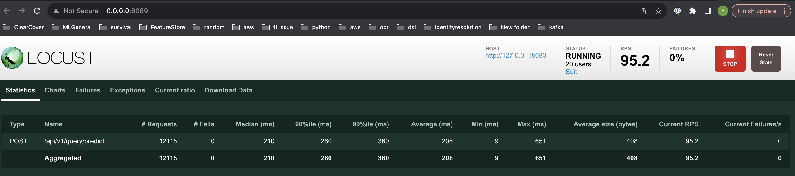

# Basic Hosting Demo
This repo contains a demo of hosting a machine learning model with FastAPI, docker, and minikube.

## Pre-requisites
- [Docker](https://docs.docker.com/get-docker/)
- [Minikube](https://minikube.sigs.k8s.io/docs/start/)
- [Kubectl](https://kubernetes.io/docs/tasks/tools/install-kubectl/)
- [hyperkit](https://minikube.sigs.k8s.io/docs/drivers/hyperkit/)
- python and virtual environment if you'd like to run the demo locally via uvicorn.


## Running the demo
### Locally via uvicorn

1. Create a virtual environment and install the requirements
Example uses conda but other alternatives works as well.

- Create and activate a new virtual environment:
    ```
    conda create -n <YOUR_ENV_NAME> python=3.10
    conda activate <YOUR_ENV_NAME>
    ```

- Install requirements
    ```
    cd basic_hosting_demo/prediction_service
    pip install -r requirements.txt
    ```
- Run the service
    ```
    cd basic_hosting_demo/prediction_service
    python -m uvicorn prediction_service.service:app --port=8001
    ```
  
- Sample call
    

    

### Locally in minikube
- If minikube and kubectl are not installed, follow the instructions [here](https://minikube.sigs.k8s.io/docs/start/) and [here](https://kubernetes.io/docs/tasks/tools/install-kubectl/) respectively.

-  Start minikube and enable metrics server
    ```
    minikube start --cpus 4 --memory 16000 --extra-config=kubelet.housekeeping-interval=10s --driver=hyperkit
    minikube addons enable metrics-server
    ```
     
    Docker driver will also be starting the service without any issue.
   
    But use **hyperkit** as driver if you'd like to run the load test. Docker driver may be slower performance.
   
- Deploy the service
    ```
    cd basic_hosting_demo
    kubectl apply -f api.yaml
    kubectl apply -f autoscale.yaml (optional, it won't trigger the autosacle at this point)
    ```
  
    Check pods and service status
    ```
    kubectl get pods
    kubectl get svc baisc-hosting-demo-svc
    ```
  
- obtain the url
    ```
    minikube service baisc-hosting-demo-svc --url
    example output:  http://192.168.67.2:32703
    ```
  
- curl (replace the url with the one you obtained from the previous step)
    ```
   curl -X POST "http://192.168.67.2:32703/api/v1/query/predict" -d '{"query": "magnetic glow rods"}' -H "Content-Type: application/json"
    ```


## Load testing
- Load testing are under the `load_test` directory.
- load testing is done using [locust](https://locust.io/).
- To run the load test, first install locust
    ```
    pip install locust
    ```
- To run the load test in UI 
   
    - replace the url with the one obtained from minikube service 
    - or if you are running the service locally, replace the url with `http://localhost:8001`
    
  ```
    cd baisc-hosting-demo-svc/load_test
    locust --users 25 --spawn-rate 1 -H http://192.168.67.2:32703
    locust --users 25 --spawn-rate 1 -H http://127.0.0.1:8001
  
    UI url: http://0.0.0.0:8089
    ```
  
  Load testing note:
  
  I observed that service running in minikube yeilds much worse performance than running locally.
  It doesn't look like resource allocation related, potentially due to overhead and networking. 
  This is never observed in a EKS cluster. Will need more time to get to the bottom of it.
  
  - Load test 50rps
  

  - Load test 100rps
  

  - Load test with minikube
  


## Dashboard
- I didn't create any elaborative dashbaord due to time restriction, but we can view basic metrics from minikube dashboard.
  
    ```
    minikube dashboard
    ```
  
## Clean up
    ```
    kubectl delete deployment baisc-hosting-demo
    minikube stop
    minikube delete
    ```

## Note
 - I didn't write any unit test due to time restriction.
 - docker hub link: https://hub.docker.com/repository/docker/yuuwwu/bastic_hosting_demo/general